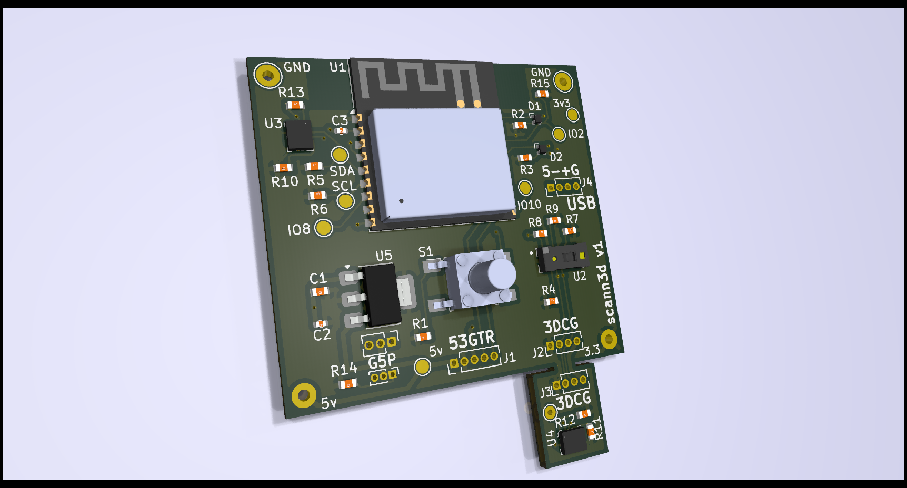
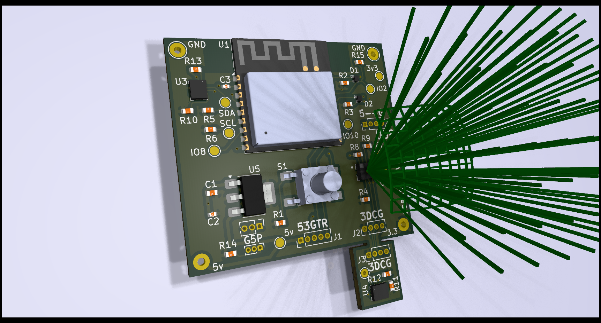

# scann3d

Real-time 3D object scanner using the VL53L8CX multi-zone time-of-flight sensor with dual LSM6DSVTR‎ IMU position tracking.

### Forked from [ferrolho/VL53L5CX-BNO08X-viewer](https://github.com/ferrolho/VL53L5CX-BNO08X-viewer)

[](https://youtu.be/s32OUzhjf4U)


## Features

- **64-zone 3D visualization** - See the VL53L8CX's 8x8 measurement grid as rays in 3D space
- **Real-time IMU tracking** - Each LSM6DSVTR‎ gives independent real-time positioning
- **Temporal filtering** - Exponential moving average smooths noisy measurements
- **Plane fitting** - Least squares and RANSAC methods for surface detection
- **Mapping mode** - Accumulate points over time to build a 3D map of your environment

## Hardware

**Components (~$34/board, porotype cost as of 2026-03-18):**

- ESP32-C3-WROOM-02-N4‎ (~$3)
- VL53L8CX ToF sensor (~$7)
- 2x LSM6DSVTR‎ IMU (~$3)

All sensors share the I2C bus (same SDA/SCL pins).

### v1





Note: Distance scanning plane here appears curved, however distance reported by the VL53L8CX is perpendicular, not radial.

## Installation

### ESP32 Firmware

[Zephyr Firmware Instructions](zephyr-firmware/README.md)

### Python Viewer

**TODO:** Unbreak the integration with this Zephyr firmware...

```bash
pip install -r viewer/requirements.txt
```

## Usage

```bash
python -m viewer --port /dev/ttyACM0
```

Open http://localhost:8080 in your browser.

**Options:**
- `--port`, `-p`: Serial port (default: `/dev/ttyACM0`)
- `--baud`, `-b`: Baud rate (default: `115200`)
- `--viser-port`: Viser server port (default: `8080`)
- `--debug`: Enable verbose logging

## Sensor Specs

**VL53L8CX** ([datasheet](https://www.st.com/resource/en/datasheet/vl53l8cx.pdf)):
- **FoV:** 65° diagonal (45° Hoizontal/Vertical)
- **Range:** 20mm - 4000mm
- **Distance type:** Perpendicular (z-axis), not radial

| Resolution | Zones | Max Frequency |
| ---------- | ----- | ------------- |
| 4x4        | 16    | 60 Hz         |
| 8x8        | 64    | 15 Hz         |

Currently configured for 8x8 at 15Hz.

## License

MIT
